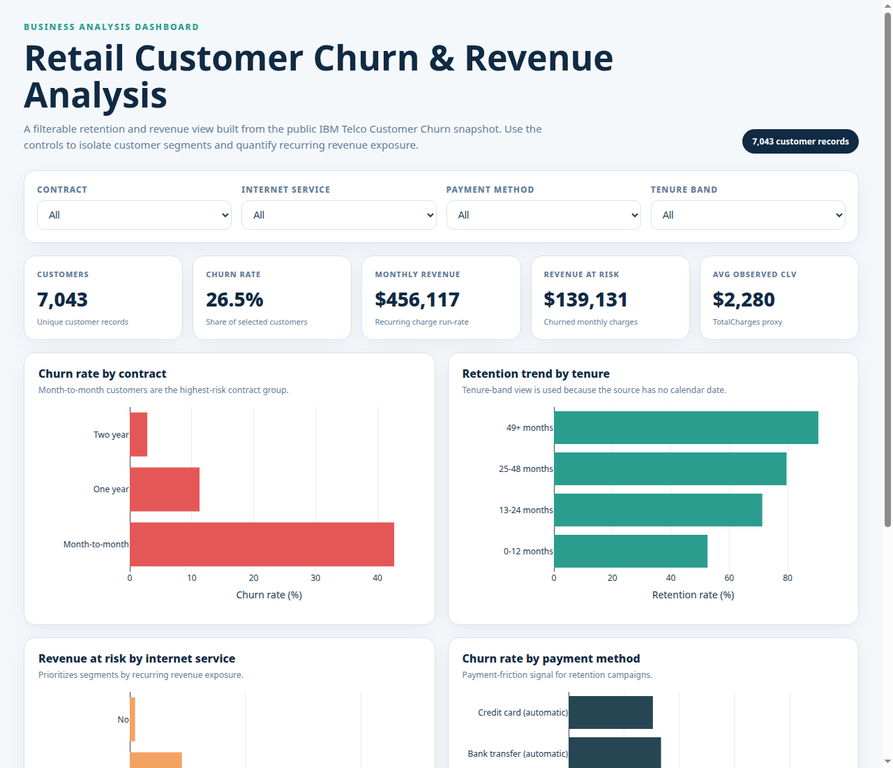

# Retail Customer Churn & Revenue Analysis

## Business Impact

This project translates customer-level churn data into an actionable retention and revenue-prioritization plan. Across **7,043 customers**, the portfolio has a **26.54% churn rate**, **$456,116.60** in monthly recurring charges, and **$139,130.85** in monthly revenue at risk. The highest-priority intervention is the month-to-month + electronic-check segment: **1,850 customers**, **53.73% churn**, and **$77,315.60** of monthly revenue at risk. A conservative 10% recovery scenario represents approximately **$92,777 annualized revenue retained** before campaign costs.

| Executive KPI | Result |
|---|---:|
| Customers | 7,043 |
| Churn rate | 26.54% |
| Monthly recurring revenue | $456,116.60 |
| Monthly revenue at risk | $139,130.85 |
| Average observed customer value | $2,279.73 |
| Rows requiring cleaning | 11 / 7,043 (**0.16%**) |

### Key findings

| Finding | Actual number | Recommended action |
|---|---:|---|
| Month-to-month contracts have the highest churn. | **42.7%** vs **2.8%** for two-year contracts; **15.1× higher**. | Run a contract-conversion and save offer. |
| Early-tenure customers are the largest retention window. | **47.4%** churn in months 0–12 vs **9.5%** for 49+ months. | Build a first-year onboarding and proactive-support journey. |
| Fiber optic customers are higher risk than DSL customers. | **41.9%** vs **19.0%**, a **22.9-point gap**. | Investigate service quality, onboarding, and expectation gaps. |
| Electronic-check customers show payment friction. | **45.3%** churn vs **17.1%** for other payment methods. | Test guided migration to automatic payment methods. |

## Dashboard preview



Open [`dashboard/retail_churn_dashboard.html`](dashboard/retail_churn_dashboard.html) locally for the interactive browser dashboard. It includes filters for contract, internet service, payment method, and tenure band, plus KPI cards for revenue, churn, revenue at risk, and observed customer value. The cleaned CSV and SQLite database are import-ready for Power BI or Tableau, while the HTML dashboard provides the reproducible interactive experience without requiring desktop authoring software.

## Project overview

The workflow uses the public IBM Telco Customer Churn sample, a fictional telco customer portfolio documented by IBM with churn, monthly charges, tenure, contract, payment, and service fields [1]. The raw CSV is preserved in `data/raw/` and the cleaned analyst-facing dataset is stored in `data/cleaned/`. Although the source is telecommunications, the analytical pattern is directly transferable to subscription retail and customer-success use cases: identify churn drivers, quantify recurring revenue exposure, and prioritize retention actions.

## Repository structure

| Folder | Contents |
|---|---|
| `data/raw/` | Original public CSV plus source notes. |
| `data/cleaned/` | Cleaned CSV, cleaning log, and SQLite database. |
| `notebooks/` | Jupyter notebooks for cleaning and business analysis. |
| `sql/` | SQLite schema, 14 commented business queries, and execution notes. |
| `dashboard/` | Interactive HTML dashboard, screenshot, and KPI definitions. |
| `reports/` | One-page business-impact report, segment metrics, analysis summary, and SQL QA output. |
| `visuals/` | Reproducible PNG charts for portfolio and README use. |
| `src/` | Source-controlled Python scripts for profiling, cleaning, analysis, SQLite loading, SQL QA, and dashboard generation. |

## Data cleaning and quality controls

The production cleaning pipeline is [`src/build_analysis.py`](src/build_analysis.py). It standardizes field names, trims categorical values, converts numeric fields, handles blank `TotalCharges`, removes exact duplicates, checks logical value ranges, screens IQR outliers, and adds business fields used by SQL and the dashboard.

The raw file contains **11 blank `TotalCharges` values**, all associated with zero-tenure customers. These values are imputed to **0.00** because no recurring charge has accumulated at zero months of tenure. There are **0 exact duplicate rows**, **0 invalid business-range values**, and **0 IQR outliers** in the two charge fields. The cleaning log is available at [`data/cleaned/cleaning_log.json`](data/cleaned/cleaning_log.json), including the exact percentage of rows touched: **0.16%**.

## SQL business-question layer

The cleaned data is loaded into [`data/cleaned/retail_churn.sqlite`](data/cleaned/retail_churn.sqlite). The table `customer_churn` contains one row per customer and derived fields for `churn_flag`, `retained_flag`, `tenure_band`, `estimated_clv`, `monthly_revenue_at_risk`, and `service_bundle`.

[`sql/business_questions.sql`](sql/business_questions.sql) contains **14 well-commented SQLite queries** covering headline KPIs, churn by contract, revenue mix, internet service, payment method, retention by tenure, top observed-value customers, top revenue-at-risk customers, service bundles, household segments, contract risk exposure, technical support, observed-value quartiles, and high-priority segment combinations. Run the full layer with:

```bash
sqlite3 data/cleaned/retail_churn.sqlite < sql/business_questions.sql
```

## Business recommendations

The one-page report at [`reports/business_impact_report.md`](reports/business_impact_report.md) translates the analysis into three concrete actions: a first-year onboarding program, a month-to-month contract-conversion campaign, and payment-friction plus fiber-service diagnostics. Each recommendation includes a transparent 10% recovery scenario based on observed monthly revenue at risk, with an explicit warning that the figures are sensitivity scenarios rather than causal forecasts.

## Reproduce the project

Create a Python 3.10+ environment and install the packages in [`requirements.txt`](requirements.txt). From the repository root, run the following commands:

```bash
pip install -r requirements.txt
python src/profile_raw.py
python src/build_analysis.py
python src/load_sqlite.py
python src/run_sql_checks.py
python src/build_dashboard.py
```

The two notebooks are [`notebooks/01_data_cleaning.ipynb`](notebooks/01_data_cleaning.ipynb) and [`notebooks/02_business_analysis.ipynb`](notebooks/02_business_analysis.ipynb). The scripts are the deterministic production path; the notebooks expose the same decisions for review and presentation.

## Tools used

Python, Pandas, NumPy, Matplotlib, Seaborn, SQLite, SQL, Plotly.js, Jupyter Notebook, and GitHub.

## Limitations and next step

The dataset is a customer snapshot with no calendar transaction date, acquisition cohort date, margin, discount, or future-survival assumption. Consequently, the dashboard uses retention by tenure band instead of a true month-over-month cohort trend, and `estimated_clv` is explicitly an observed `TotalCharges` proxy rather than a predictive CLV model. The next production improvement would be to append dated billing or subscription snapshots so that cohort retention, monthly revenue movement, and causal campaign measurement can be tracked.

## References

[1]: https://www.ibm.com/docs/en/cognos-analytics/12.1.x?topic=samples-telco-customer-churn "IBM: Telco customer churn sample documentation"

[2]: https://github.com/IBM/telco-customer-churn-on-icp4d/blob/master/data/Telco-Customer-Churn.csv "IBM GitHub: Telco-Customer-Churn.csv"

[3]: https://www.kaggle.com/datasets/blastchar/telco-customer-churn "Kaggle: Telco Customer Churn"
